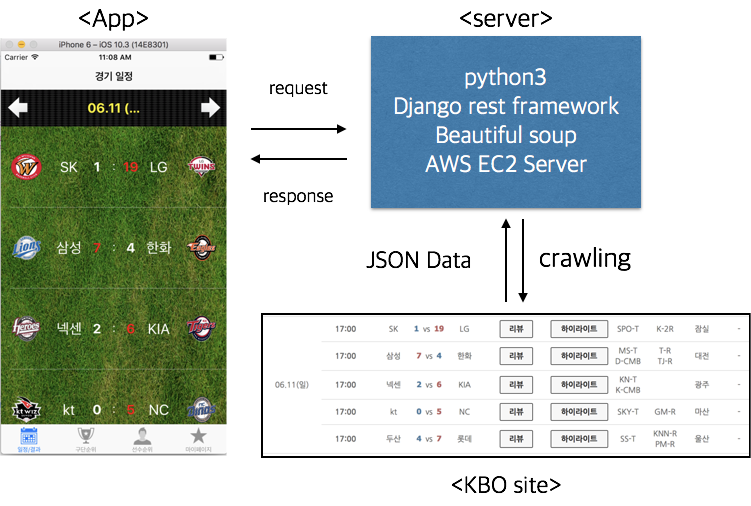

# KBO

팀명: 몸 쪽 꽉찬 공
팀원: 구장회, 김태호, 유병민

깔끔하고 직관적인 UI로 KBO 데이터 기록실의 정보를 실시간으로 받아 볼 수 있는 애플리케이션
                    +
경기 예측으로 응모권을 받고 이로 경품 추천을 할 수 있다!

# 추진 배경

 야구는 많은 사람들이 좋아하는 인기 스포츠이다. 이러한 야구에서 뺴놓을 수 없는 재미가 데이터를 분석하고 예측하는 것이다. 야구 팬이라면 야구는 데이터의 스포츠라는 것을 누구나 다 알 수 있다.

하지만 야구 데이터를 깔끔하게 정리해준 곳은 그리 많지 않다. KBO 공식 사이트를 찾아가서 정보를 보고 분석하기엔 너무 번거럽고 디자인 또한 깔끔하지 못하다.

우리는 이러한 문제를 해결하고자 어플리케이션을 개발하기로 하였다. 깔끔하고 직관적인 UI, 실시간 데이터 업데이트를 바탕으로 데이터의 미학인 '예측'을 할 수 있게 하였다.

사용자가 야구의 소소한 재미를 더욱 편하게 즐길 수 있기를 바란다.

# 어플리케이션

1. 데이터 통계
    
    공식 KBO 기록실의 데이터를 크롤링을 통해 서버에 저장, 앱에서 실시간으로 보여주는 서비스.
    
    1) 일정
        
        경기 일정에 대한 정보를 보여준다. 당일을 기준으로 3일 전과 후의 정보를 볼 수 있다. 
        이미 지난 경기에 대해서는 경기 결과를 볼 수 있고 아직 하지 않은 경기에 대해서는 경기 예측을 해서 응모권을 받을 수 있다.

    2) 구단 순위

        프로야구 10개 팀의 구단 순위를 볼 수 있다

    3) 선수 순위
    
        투수, 타자의 각각의 조건에 맞춘 순위가 나타난다. 
    

2. 경품 추첨

    Device의 고유 ID와 경기 예측이 대한 결과를 바탕으로 서버 DB에 사용자 응모권 관리

    사용자는 받은 응모권을 바탕으로 경품을 추첨할 수 있다.

# 앱의 모식도 

